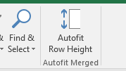

# Excel Autofit

Autofit merged cells with this Excel add-in.

The autofit function built into *Microsoft Excel* is very handy but it doesn't
work on merged cells! This can be frustrating. This add-in will provide an
alternative autofit function which will autofit all selected cells, including
merged cells.

Compatible with Windows and Mac.

## Download

[Autofit.xlam](https://github.com/mattpalermo/Excel-Autofit/releases/download/v0.1.0/Autofit.xlam)
(version 0.1.0)

## Instructions

The *Excel Autofit* add-in will add a new button labelled *Autofit row height*
in the *Home* menu of Excel. First select the cells you
want to autofit and then press the button. If there is a lot of autofitting to
do, it may take some time. Watch the status bar for a progress counter. It is
usually found at the bottom left of the Excel window.

**Important:** Using the autofit button will erase your undo history.

**Note:** The autofit doesn't work properly on merged cells spanning multiple
rows. See the *Helping out* section to help fix this.

## Support

You can submit questions, requests and bug reports to the
[issues list](https://github.com/mattpalermo/Excel-Autofit/issues).
Github pull requests are also welcome.

## Helping out

There are a few improvements that could still be made to the add-in. See the
[issues list](https://github.com/mattpalermo/Excel-Autofit/issues) for known
problems. Github pull requests are welcome, otherwise get in contact via the
[issues list](https://github.com/mattpalermo/Excel-Autofit/issues) or email at
[matt.r.palermo@gmail.com](mailto:matt.r.palermo@gmail.com).

If you plan to hack on the code, I have used the
[VBA-Import-Export](https://github.com/mattpalermo/VBA-Import-Export) add-in to
simplifying importing and exporting the VBA code. Feel free to try it out.
Manually importing and exporting will work as well so don't fret over it if you
don't want to use it.

## Authors and Attributions

* **James Furnell** - Commissioned the creation of *Excel Autofit*
* **Matthew Palermo** - Author

* **[Marcus Small](http://www.thesmallman.com/autofit-merged-cells/)** - His
*autofit merged cells* code shows how to solve the Autofit problem and was
used as a reference to create *Excel Autofit*.

## See also

* [ASAP Utilities for Excel](http://www.asap-utilities.com/) - A commercial
add-in which includes the same functionality and *much* more. I recommended
trying this add-in as well if you are using Windows (doesn't work on Mac).
